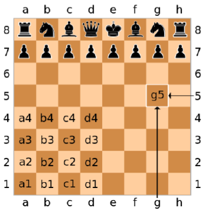

# Assegnazione Progetto

## Progetto assegnato: **Scacchi**

- Applicazione per il gioco *2-players* degli scacchi,
  con interfaccia a linea di comando(CLI)

- Le mosse sono descritte in [Notazione algebrica](https://it.wikipedia.org/wiki/Notazione_algebrica)
   
    1. e4 e5  

    2. Cf3 Cc6  

    3. d4  

