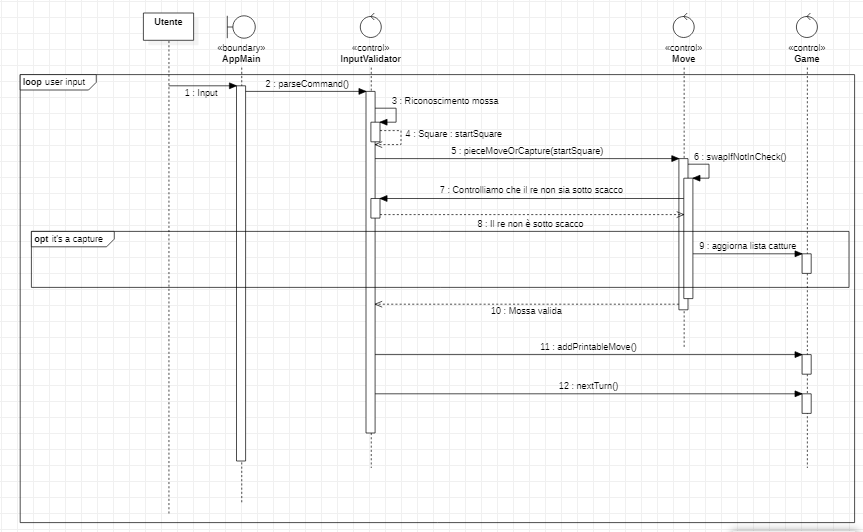
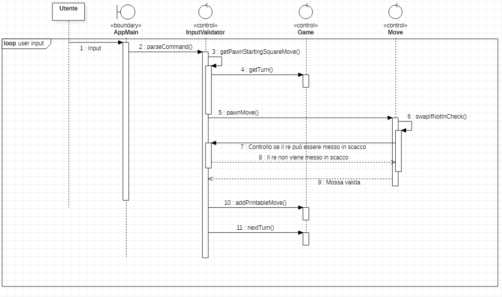
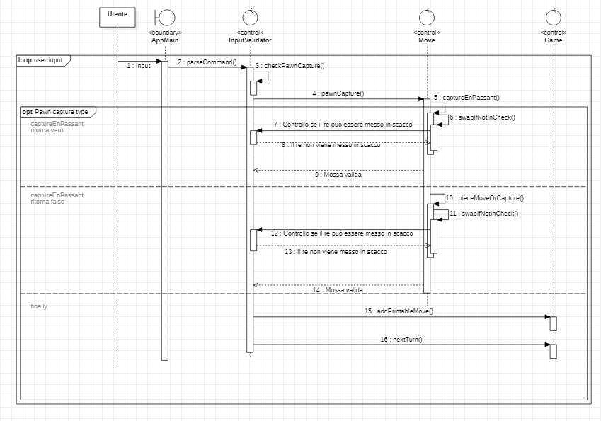
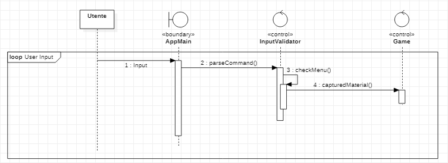

# Report

# 1. Introduzione
La seguente relazione mira a rappresentare l'applicazione di scacchi sviluppata per il corso di Ingegneria del Software dal gruppo Diffie nell'A.A. 2019/2020 , composto da Barbaro Nicola, Cucinotta Nicolò, De Rosis Antonio e Porcelli Luigi. 
L'applicativo consente di giocare una partita di scacchi accettando in input mosse in notazione algebrica italiana (vedi paragrafo  **7. Manuale Utente**)

# 2. Modello di Dominio

# 3. Requisiti specifici

### a. Requisiti funzionali
 - Come utente, voglio iniziare una nuova partita:
	  - Al comando `play` il sistema si predispone a ricevere mosse o comandi
 - Come utente, voglio vedere la scacchiera:
	 - Al comando `board` mostra la scacchiera completa di coordinate e pezzi in Unicode
 - Come utente, voglio vedere la lista dei comandi disponibili :
	 -  Al comando `help` verrà stampato il menù dei comandi, uno per riga
 - Come utente, voglio chiudere il gioco:
	 - Al comando `quit`, viene terminata l'esecuzione
 - Come utente, voglio visualizzare le catture:
	 - Al comando `captures`, si mostra il materiale vinto in formato Unicode
 - Come utente, voglio vedere la lista delle mosse giocate:
	 - Al comando `moves` l'applicazione mostra l'elenco delle mosse effettuate in notazione algebrica italiana abbreviata
 - Come utente, voglio muovere un pedone:
	 - Attraverso una mossa in notazione algebrica abbreviata, il pedone deve potersi muovere e catturare (normalmente e in en-passant) secondo le regole degli scacchi. In caso di mossa illegale, viene stampato un messaggio e l'applicazione rimane in attesa di mossa valida.
 - Come utente, voglio muovere un cavallo:
  	 - Attraverso una mossa in notazione algebrica abbreviata, il cavallo deve potersi muovere e catturare secondo le regole degli scacchi.  In caso di mossa illegale, viene stampato un messaggio e l'applicazione rimane in attesa di mossa valida.
 - Come utente, voglio muovere un alfiere:
	 - Attraverso una mossa in notazione algebrica abbreviata, l'alfiere deve potersi muovere e catturare secondo le regole degli scacchi.  In caso di mossa illegale, viene stampato un messaggio e l'applicazione rimane in attesa di mossa valida.
 - Come utente, voglio muovere una torre:
	 - Attraverso una mossa in notazione algebrica abbreviata, la torre deve potersi muovere e catturare secondo le regole degli scacchi.  In caso di mossa illegale, viene stampato un messaggio e l'applicazione rimane in attesa di mossa valida.
 - Come utente, voglio muovere una donna:
	 - Attraverso una mossa in notazione algebrica abbreviata, la donna deve potersi muovere e catturare secondo le regole degli scacchi.  In caso di mossa illegale, viene stampato un messaggio e l'applicazione rimane in attesa di mossa valida.
 - Come utente, voglio muovere un re:
	 - Attraverso una mossa in notazione algebrica abbreviata, il re deve potersi muovere e catturare secondo le regole degli scacchi. Il re non può muoversi in case minacciate da pezzi avversari. In caso di mossa illegale, viene stampato un messaggio e l'applicazione rimane in attesa di mossa valida. 
 - Come utente, voglio arroccare corto:
	 - Attraverso una mossa in notazione algebrica abbreviata, devo poter arroccare secondo le regole degli scacchi ( come da esempio nel paragrafo **7. g. Mosse illegali**)
 - Come utente, voglio arroccare lungo
	 - Attraverso una mossa in notazione algebrica abbreviata, devo poter arroccare secondo le regole degli scacchi ( come da esempio nel paragrafo **7. g. Mosse illegali**)

###  b. Requisiti non funzionali

 **Portabilità**: attraverso Docker si vuole utilizzare il programma su qualunque piattaforma, mantenendo un comportamento uniforme. Le shell supportate sono le seguenti, suddivise per sistema operativo :
 - ***Linux***:
	-  Terminal
- ***Mac OS***:
	- Terminal
- ***Windows***:
	-  Terminal del sottosistema Windows per Linux
	-   Git Bash (in questo caso il comando Docker ha come prefisso  `winpty`; es:  `winpty docker -it ....`)
	- Windows Terminal (Preview)
		
 **Affidabilità**: se vengono immessi comandi non riconosciuti o mosse grammaticalmente/logicamente sbagliate, il programma continua il flusso di esecuzione in uno stato stabile.

# 4. System Design

Vista la natura monolitica del programma, non è risultata necessaria l'applicazione di alcun design architetturale.
L'intero eseguibile è racchiuso in un singolo file .jar che non interagisce con ulteriori applicativi.

# 5. OO Design

### a. Diagrammi delle classi e diagrammi di sequenza

 - ***Diagramma generale delle classi***:  
 - ***Diagramma delle classi specifico per la struttura dei pezzi***: 
 ---
 - ***Diagramma di sequenza per movimento/cattura di un pezzo generico escluso il pedone***:  Riconosciuta in input una notazione algebrica valida, si invoca il metodo adatto per trovare la casa di partenza. Se trovata, si procede poi a effettuare la mossa, nel caso il pezzo non risultasse inchiodato, attraverso il metodo `swapIfNotInCheck()`. Infine si invoca `nextTurn()` per cambiare il turno e si aggiunge la mossa alla lista di quelle effettuate invocando `addPrintableMove()`. In caso di cattura, si aggiorna la lista delle catture.  
 - ***Movimento di un pedone***: Riconosciuta in input una mossa del pedone, cerchiamo la plausibile casa iniziale con `getPawnStartingSquareMove()` , il cui comportamento dipende dal turno corrente ottenibile con `getTurn()`. In caso di risoluzione positiva, si invoca `pawnMove()` che effettua la mossa se non è inchiodato. Si aggiunge poi la mossa alla lista di quelle effettuate e si cambia il turno.
 - ***Cattura di un pedone***:  Riconosciuta una cattura del pedone, cerchiamo una casa iniziale attraverso il metodo `checkPawnCapture()`. La chiamata a `pawnCapture()`  tenterà di effettuare una cattura in en-passant. In caso negativo, provvediamo a fare una cattura classica. In entrambi i casi essa avviene solo un controllo sul fatto che il pezzo non sia inchiodato e provvede, in caso positivo, ad aggiornare la lista delle catture, delle mosse effettuate e cambia il turno. 
 - ***Arrocco lungo***: Riconosciuta una notazione valida per l'arrocco lungo, si procede con i controlli stabiliti dalle regole degli scacchi per effettuare lo stesso contenuti in `longCastle()`. In caso positivo, si effettua la mossa, si aggiunge alla lista delle mosse e si cambia il turno. 
 - ***Mostrare la scacchiera***: Si richiama il metodo `print()` contenuto in `Board`.
 - ***Mostrare le catture***:  Si invoca il metodo `capturedMaterial()` contenuto in `Game`
  - ***Mostrare le mosse giocate***:  Si invoca il metodo `printListOfMoves()` in `Game`

### b. Design pattern

 - **Singleton**: le classi `Game`, `Move` e `InputValidator`, sebbene non rispettino l'implementazione da manuale del pattern "classe Singleton", vengono utilizzate come tali.
 - **Interpreter**:  `InputValidator` si avvale di un'espressione regolare per riconoscere la mossa degli scacchi effettuata e determinare il flusso di esecuzione del programma.

### c. Motivazione delle scelte di design

- La suddivisione, determinata da accorpamenti di responsabilità comuni, avviene in 3 package:

	- `it.uniba.chess` : contiene tutti gli elementi relativa alla logica del gioco degli scacchi
	- `it.uniba.chess.pieces` : contiene tutti i pezzi e un'interfaccia generica Piece
	- `it.uniba.chess.utils` : contiene classi con comportamenti utili all'interno del programma

- L'input dell'utente viene analizzato e sanificato dalla funzione `parseCommand()` della classe `InputValidator` in modo da avere un entry-point comune e rigettare quanto prima possibile un comando non riconosciuto o una mossa illegale senza interagire con lo stato della partita;

- Per il riconoscimento delle mosse ci siamo ispirati ad acclamati siti di scacchi (e.g. Lichess, chess24, chess.com) e abbiamo utilizzato un pattern Interpreter al fine di non ricadere in una cascata di innumerevoli e poco manutenibili blocchi if-else;

- Le mosse (movimenti e catture) non sono state inserite nei singoli pezzi per evitare dipendenze dal resto della scacchiera o dallo stato del gioco. I pezzi devono esistere come elementi a sè stanti, anche al di fuori della partita;

- `AppMain` raccoglie tutte le funzioni che richiedono input utente, in modo da avere una ben definita classe di tipo *<< Boundary >>*;

- Le tre classi Singleton sono state scelte come tali vista l'impossibilità di avviare contemporaneamente più di una partita.

- `InputValidator` e `Move` , tra loro complementari, vengono separate per avere un ruolo ben specifico: la prima si occupa di lavorare con stringhe e riconoscere la mossa, la seconda è quella che ne calcola l'effettiva validità secondo le regole degli scacchi e, in caso positivo, modifica lo stato della scacchiera e del gioco.

- Arrocco lungo e corto sono considerate mosse speciali che agiscono su case predeterminate, quindi il loro comportamento è ben definito all'interno di `Move.longCastle()` e `Move.shortCastle()`, rendendole autosufficienti nella gestione della scacchiera e dello stato della partita.

# 6. Riepilogo del test
Sono stati effettuati 234 casi di test, per una copertura del codice sorgente pari al 100%. Non si è puntato al coverage totale come obiettivo primario, bensì si è prediletta l'ideazione di casi limite per massimizzare il requisito di affidabilità.

# 7. Manuale utente
- ### a. Introduzione 
	Questo manuale utente è da intendersi come guida all'utilizzo dell'applicazione, esponendo le sue features e come interfacciarsi con esse. Per ogni mossa riportata si fa capo alla [notazione PGN](https://it.wikipedia.org/wiki/Notazione_Portable_Game).
 - ### b. Comandi disponibili 
	L'applicazione risponde ai seguenti comandi visualizzabili in qualsiasi momento attraverso il menù `help` : 
	1. `play`
		Inizia una nuova partita. In caso di partita già avviata, dopo aver ricevuto conferma, permette di ricominciare la partita (tutti i progressi della partita precedente verranno persi);
	2. `help` 
			mostra il menù dei comandi (anche a partita avviata);
	3.  `quit `
		Termina, a seguito di una conferma, l'esecuzione del programma (tutti i progressi della partita verranno persi);
	4. `board` 
		Stampa la scacchiera mostrando la posizione dei pezzi aggiornata all'ultima mossa eseguita (solo a partita avviata);
	5. `captures` 
	Mostra il materiale catturato da ogni colore (solo a partita avviata);
	6. `moves` 
	Elenca le mosse giocate da entrambi i colori (solo a partita avviata).
	
- ### c. All'avvio 
	 Il programma permette di iniziare una nuova partita con `play` o permette di eseguire il comando `help` per visualizzare il menù. Ovviamente è sempre possibile digitare `quit` per terminare l'esecuzione.

- ### d. Introduzione all'interfaccia
	La scacchiera è formata da 64 case, ed è idealmente formata da 8 traverse (con notazione numerica da **1 - 8**, riportate ai lati della scacchiera) e da 8 file (in notazione **a - h**, riportate sotto e sopra la scacchiera). Sulle traverse **1** e **2** sono disposti i pezzi del bianco e sulle traverse **7** e **8** sono disposti, al contrario, i pezzi del nero. 

- ### e. Mosse supportate e relativa notazione

	 È possibile muovere qualsiasi pezzo presente sulla scacchiera, rispettando sempre le regole degli scacchi e il naturale modo in cui i singoli pezzi si muovono; 
	 
	 Generalmente, per muovere un pezzo basterà unire la lettera iniziale del suddetto, scrivendola in maiuscolo, unita alla casa finale che si vuole occupare(E.g. :  **Ca3** per muovere un Cavallo in casa a3, oppure **Dd5** per muovere una Donna in casa d5 ). Per muovere il pedone basterà indicare la casa finale( E.g. : **e4**, **c5**).
	 
	Per catturare un pezzo avversario con un proprio pezzo va aggiunta la notazione **x** tra la lettera maiuscola del pezzo che cattura e la casa di destinazione (E.g.: **Axd6** intende dire che un Alfiere cattura in casa d6). Se la cattura è effettuata con un pedone, va indicata la fila iniziale, accompagnata dal simbolo **x** e dalla casa di destinazione (E.g.: **exd4** intende dire che un pedone presente nella fila *e* si sposta nella casa *d4* catturando il pezzo avversario che la occupava precedentemente).
	Per arroccare corto basterà digitare il comando **0-0** (alternativamente **O-O**, oppure **Rg1** per il bianco e **Rg8** per il nero), al contrario per l'arrocco lungo andrà digitato il comando **0-0-0** (alternativamente **O-O-O**, oppure **Rc1** per il bianco e **Rc8** per il nero).

	La cattura in *en passant* è opzionalmente accompagnabile alla notazione **e.p.** nel caso sia effettivamente plausibile questo tipo di cattura speciale. Il sistema riconoscerà la cattura in *en passant* anche nel caso in cui il comando digitato non presenti la notazione suddetta. 

- ### f. Disambiguazioni
	La notazione ammette disambiguazioni di fila e traversa nel caso non sia possibile definire con semplicità il pezzo che deve spostarsi nella casa di destinazione. Per esempio, ponendo due Torri nelle case *a4* e *f4*, scrivendo semplicemente **Tc4** incapperemmo in un caso di ambiguità perché il programma non ha la possibilità di determinare quale Torre sia quella effettivamente designata dall'utente. 
	
	Sapendo che le Torri condividono la stessa traversa (la **4**) ma non la stessa fila (rispettivamente **a** e **f**), è possibile sfruttare quest'ultima per distinguere il pezzo da muovere, anteponendo alle coordinate della casa finale la fila di partenza (E.g.: **Tfc4** risolve con chiarezza la questione). 

	Il caso contrario, quello di fila uguale ma traversa differente è ugualmente coperto (ovviamente andrà posto il numero di traversa in quel caso, es. **T4c6**), ed entrambe le trattazioni sono accettate anche in caso di cattura (basterà porre una **x** tra il carattere di disambiguazione e la casa di destinazione, es. **Tfxc4**).
	In nessun caso è possibile digitare una mossa "disambiguata" per il pezzo del Re, essendo per natura sempre e solo uno per ogni colore sulla scacchiera. 
	
- ### g. Mosse illegali
	È possibile che il programma restituisca un messaggio di errore "*Mossa Illegale*" nel caso in cui l'esecuzione di una mossa non sia andata a buon fine. I motivi possibili per cui si presenti questo errore sono i seguenti:

	1. La grammatica della mossa digitata non rispetta le regole della notazione PGN
( Eg.: **a9** non è accettata perché la traversa **9** non esiste, oppure **Se4** è altrettanto inaccettabile perché pur riportando una casa esistente, non esiste un pezzo che abbia come iniziale la lettera **S**);
	2. La casa di destinazione è occupata da un pezzo avversario, ma non è stata riportata la notazione di cattura (**"x"**);
	3. Viceversa, la casa di destinazione è libera ma è stata riportata la notazione di cattura;
	4. La casa di destinazione è occupata da un pezzo dello stesso colore. Non è possibile in alcun modo sostituire il pezzo già occupante con il pezzo designato per la mossa.
	5. La mossa eseguita porrebbe il Re alleato *sotto scacco*, in questo caso il pezzo designato si intende come *inchiodato* (o *pinnato*) alla sua casa e non può essere mosso, pena la violazione della regola dello scacco;
	6. È stata digitata una mossa riportante una disambiguazione per muovere il Re (E.g.: **Rfe5**);
	7. Il tentativo di arroccare è fallito a causa di pezzi interposti tra il Re e la Torre, una delle case attraversate dal Re risulta minacciata da un pezzo avversario oppure il Re o la Torre sono stati già mossi in precedenza;
	8. È stata riportata la notazione **e.p.** quando non era effettivamente plausibile una cattura in *en passant*.  
	9. Si tenta di muovere il Re alleato verso una casa difesa da un pezzo avversario, Re nemico incluso.

# 8. Processo di sviluppo e organizzazione del lavoro
Come team, abbiamo scelto sin da subito di mantenere un comportamento che potesse simulare il più possibile il tipico ambiente lavorativo nello sviluppo agile del software.

 Ci siamo ispirati al concetto di Scrum tenendo un incontro all'inizio di ogni giornata lavorativa. Il team ha preferito distribuire equamente il carico lavorativo dividendosi normalmente in gruppi da 2 persone, eccetto nei casi di scelte progettuali che avrebbero influenzato le successive componenti sviluppate. Questo metodo di divisione dei compiti ha permesso di esaltare le qualità del singolo membro, lasciando ampio spazio alla propria creatività e alle proprie capacità.

A fine giornata, attraverso un debriefing, ogni membro aggiornava il team sugli sviluppi del giorno e sugli obiettivi posti per la giornata lavorativa seguente. In caso non fosse possibile una comunicazione di tipo verbale, ci si affidava ad un file di testo condiviso che veniva aggiornato per includere i sopracitati aggiornamenti.
Imperativo è stato l'utilizzo delle deadlines e la presenza di giornate di riposo, che permetteva di mantenere un'alta produttività e un sano bilancio vita-lavoro.

# 9. Analisi retrospettiva

Adottare uno stile lavorativo agile dal primo giorno si è rivelata una scelta sempre migliore nel corso degli Sprint, 
poiché ci ha permesso di avere spazi per impegni personali.

Lavorare per un progetto che è rivolto a varie categorie non strettamente correlate all'ambito informatico.
E' stato interessante re imparare  il gioco degli scacchi in chiave algoritmica e scoprire che conoscenze pregresse del gioco non semplificano più di tanto la progettazione del software.

E' stato inizialmente deludente non ottenere il punteggio massimo nello sprint 1 a causa di una svista algoritmica risoltasi con una modifica irrisoria del codice. Ciononostante ci è servito per rivalutare il tempo dedicato alla fase di Debug, che ci ha permesso di ottenere risultati migliori allo sprint successivo.

La dipendenza da Unicode è risultata spesso più complessa da gestire del previsto alla ricerca di "flag" aggiuntivi per il supporto ad UTF-8.
